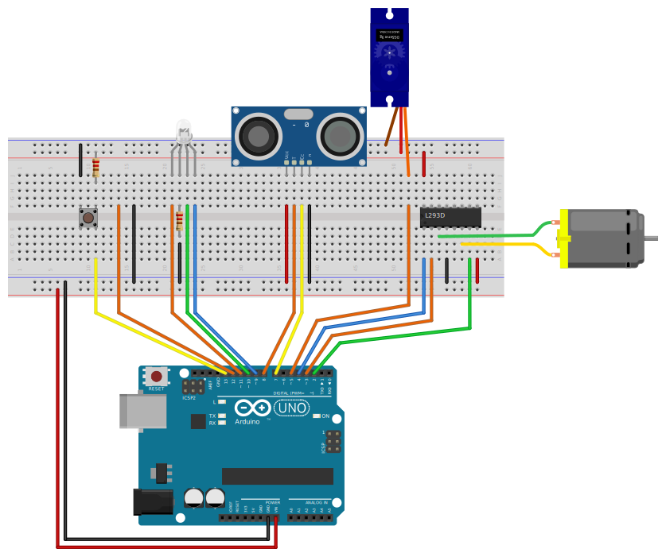

# CalPoly-EPIC-RGM
Super duper epic Rube Goldberg Machine made with an Arduino.

Push the button to activate the servo. 3 seconds later, the motor 
activates. Then, when something moves in front of the HC-SR04, a
song plays.

## Breadboard
NOTE: the image is missing wires to connect the top and bottom
power rails. Either something should be added to connect them,
or only the bottom one should be used.

## Demo
[Demo](https://youtu.be/uu_OtAkOIzY)
